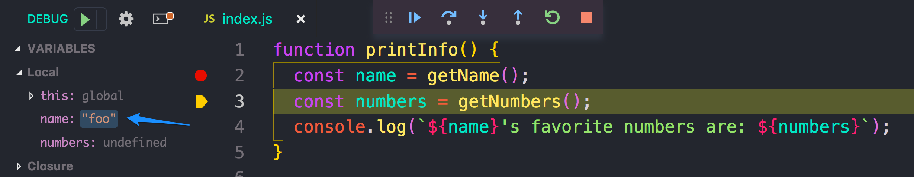

# image:orange-method-sticker.png[caption="Orange Method", title="Orange Method", alt="Orange Method", width="130", link="https://github.homedepot.com/OM-JavaScript"] {lesson-title}
:lesson-title: Debugging with VS Code
:tags: javascript debugging dev-tools
:description: An Introduction to Debugging
include::../node_modules/@orangemethod/asciidoc-common/vars.adoc[]

{description}

link:index.html[Back to JavaScript Foundations]

## Learning Objectives

### Concepts

* Showcase VS Code's debugging features
* Understanding breakpoints
* Step through function calls

### Skills

* You will be able to debug code with ease!

## Intro

Often IDE's provide built in debugging tools, and though VS Code is a text editor, it also provides several IDE-like built in features. One of those features in the Debugger.


## Debugging

The debugger can be found on the sidebar, and is signified by the no-bug icon. After clicking on the debugging icon, you'll see a new panel in place of your file tree.

image::vs-code-panel.png['150', '150']


### Working with Breakpoints

The core of debugging is working with breakpoints. 

[IMPORTANT]
A breakpoint is an intentional stopping or pausing place in a program for debugging purposes

Breakpoints give you the magical power to halt your application mid-execution to inspect the entire stack. You are then able to:

* *step into* functions calls - magically transport to the current function being executed
* *step over* - proceed to the next executable line of code
* *step out* of the current function - move into the next function being called in the stack

#### A simple example

To get started, we'll debug a very simple bit of code. 

[source,javascript,linenums]
.index.js
----
function printInfo() {
  const name = getName;
  console.log(`${name}'s favorite numbers are: ${numbers}`);
  const numbers = getNumbers;
}

function getName() {
  "foo";
}

function getNumbers() {
  [35, 42, 100];
}

printInfo();
---- 

At a glance, you can probably figure out what's wrong with the above snippet. However, let's used the debugger to figure out what's going on. 

We'll start by simply running the program with `node index.js`, which should lead an error resembling: 

```
console.log(`${name}'s favorite numbers are: ${numbers}`);
                                                 ^

ReferenceError: numbers is not defined
    at printInfo (/Users/mxb5594/playground/debugging/index.js:3:50)
    at Object.<anonymous> (/Users/mxb5594/playground/debugging/index.js:15:1)
    at Module._compile (internal/modules/cjs/loader.js:689:30)
    at Object.Module._extensions..js (internal/modules/cjs/loader.js:700:10)
    at Module.load (internal/modules/cjs/loader.js:599:32)
    at tryModuleLoad (internal/modules/cjs/loader.js:538:12)
    at Function.Module._load (internal/modules/cjs/loader.js:530:3)
    at Function.Module.runMain (internal/modules/cjs/loader.js:742:12)
    at startup (internal/bootstrap/node.js:279:19)
    at bootstrapNodeJSCore (internal/bootstrap/node.js:696:3)
```

##### Starting the debugger

To start the debugger, we'll add a breakpoint to line 3, and click the green play button in the top left corner. 

image:setting-breakpoint.png[]

[TIP]
After a moment, we'll see a new a panel at the top with options for debugging

image:debug-features.png[]

[IMPORTANT]
This panel allows us to step through the code line by line. In addition to that, we can hover over our variable to get additional insights. 

In addition to hovering over the code to get info, we can also look at the side panel for helpful information regarding values stored in variables, the call stack, and more. 

If we hover over `numbers`, we'll see that it is undefined. Let's move that above our `console.log` statement and remove the breakpoint. 

[source,javascript,linenums]
.index.js
----
function printInfo() {
  const name = getName;
  const numbers = getNumbers;
  console.log(`${name}'s favorite numbers are: ${numbers}`);
}
---- 

Running the program again with `node index.js` will output some unexpected info. 

```
function getName() {
  "foo";
}'s favorite numbers are: function getNumbers() {
  [35, 42, 100];
}
```

While that's unexpected, we can easily see that our functions are not being invoked. Let's change that.

[source,javascript,linenums]
.index.js
----
function printInfo() {
  const name = getName();
  const numbers = getNumbers();
  console.log(`${name}'s favorite numbers are: ${numbers}`);
}
---- 

Running `node index.js` we should get the following output

```
undefined's favorite numbers are: undefined
```

##### Step Into

Okay, as you can probably guess what's wrong here. We're going to act as if we don't. Instead, we'll set a breakpoint on line 2 so we can step through the code. 

After setting the breakpoint, go ahead and click the play button. Our code will stop at line 2. From there, we will choose the third option on the top debugging panel - **step into**. This will take us into the `getName` function

image:step-into.png[]

We can now see that `foo` is not being returned. We can change that and then run our debugger again by choosing the **restart** option. This option is the green circle on the debugging panel.

##### Step Over

Now, we'll select the second option in the debug panel - **step over** - which will move to the next line of code. 

You may notice that our variables panel was also updated as we stepped to the next line. 



Let's click **step over** again, to see what's happening on line 4. 

By hovering over `numbers` we will see that this variable is still `undefined`. We know a fix for this, so we'll add a `return` statement to `getNumbers`

We should be able to **stop** the debugger at this point and execute the program with `node index.js`, which should print out the expected results. 

While there is much more to debugging, this will get you going. 

## Group Exercise

Now for a more complex example. It turns out we have inherited a file that is full of errors. Instead of throwing `console.log` statements all over the place, let's debug. 

Your mission: Help the instructor debug the following code.

[source,javascript,linenums]
.antsGoMarching
----
var littleOne = [];
var howTheyMarch = ["one by one", "two by two", "three by three", "four by four", "five by five", "six by six", "seven by seven", "eight by eight", "nine by nine", "ten by ten"];

function theAntsGoMarching(){
    for (var i = 0; i < howTheyMarch.length; i++){
        howManyByHowMany;
        console.log(littleOne[i]);
        console.log("And they all go marching down to the ground to get out of the rain, BOOM! BOOM! BOOM!");
    }
}
theAntsGoMarching();

littleOne[0] = "The little one stops to suck her thumb";
littleOne[1] = "The little one stops to tie his shoe";
littleOne[2] = "The little one stops to climb a tree";
littleOne[3] = "The little one stops to shut the door";
littleOne[4] = "The little one stops to take a dive";
littleOne[5] = "The little one stops to pick up sticks";
littleOne[6] = "The little one stops to pray to heaven";
littleOne[7] = "The little one stops to roll a skate";
littleOne[8] = "The little one stops to check the time";
littleOne[9] = "The little one stops to shut The End";

function howManyByHowMany(number){
    const numbers = howTheyMarch;
    const hurrah = " hurrah, hurrah \n";
    const march = "The ants go marching " + numbers;

    console.log(march + hurrah + march + hurrah + march);
}
----

The expected output for this program should resemble: 

```
The ants go marching one by one hurrah, hurrah
The ants go marching one by one hurrah, hurrah
The ants go marching one by one
The little one stops to suck her thumb
And they all go marching down to the ground to get out of the rain, BOOM! BOOM! BOOM!

The ants go marching two by two hurrah, hurrah
The ants go marching two by two hurrah, hurrah
The ants go marching two by two
The little one stops to tie his shoe
And they all go marching down to the ground To get out of the rain, BOOM! BOOM! BOOM!
```

Unfortunately, running the code will result in the following output:

```
undefined
And they all go marching down to the ground to get out of the rain, BOOM! BOOM! BOOM!
undefined
And they all go marching down to the ground to get out of the rain, BOOM! BOOM! BOOM!
```

Given that we don't know what is going here. Our next step would be to determine a breakpoint. A good starting point would probably be the `antsGoMarching()` function call, so we'll add a breakpoint to line 24. 

From here, we'll step through the code as a group to correct the code. 

## LAB 1 - Debugging in VS Code

* Using similar steps, work through this code using the VS Code debugging tools

[source,javascript]
.baabaaBlacksheep
----
const woolOwners = [
  {
      "master": 1
  },
  {
    "dame": 1
  },
  {
    "little boy": 1,
    "location": "down the lane"
  }
];


const bags = haveYouAnyWool;

const haveYouAnyWool = function() {
    for (var i = 0; i < woolOwners.length; i++) {
    let totalBags = totalBags + i;
    }
    return (i);
};


function baabaaBlackSheep() {
    console.log("BaaBaa BlackSheep have you any wool?");
    if (bags > 0) {
        console.log("yes sir, yes sir " + totalBags + " bags full");
  }
}

function oneForMy() {
    for (var i = 0; i < 2; i++) {
        people = Object.keys(woolOwners);
        let person = people.toString();
        console.log("one for my " + person);
    }
}

baabaaBlackSheep();
oneForMy();

const boy = Object.keys(woolOwners[2]);
const littleBoy = boy[2];

const whereHeLives = littleBoy.location;
console.log("one for the " + littleBoy + " that lives " + whereHeLives);
----

* your output should be:

```
Baa, baa, black sheep, have you any wool?
Yes sir, yes sir three bags full
One for the master
One for the dame
And one for the little boy that lives down the lane
```

## Summary

We have just scratched the surface with debugging, but as you can see, debugging is an extremely useful way to understand what's happening in your code. 

Often, it is a great alternative to using `console.log` as you get line-by-line insights to how your program is operating. 

## Additional Resources

* link:https://code.visualstudio.com/docs/introvideos/debugging[Intro to debugging with VS Code^]
* link:https://scotch.io/tutorials/debugging-node-code-in-vs-code[Debugging Node in VS Code^]
